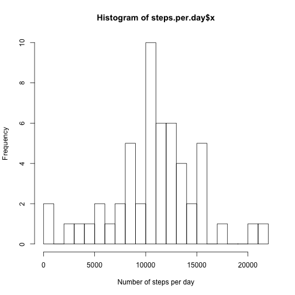
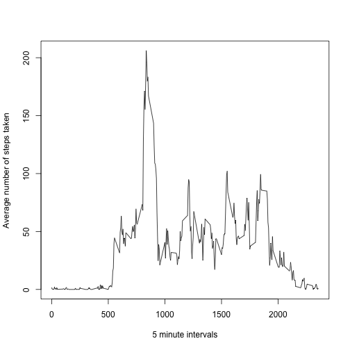
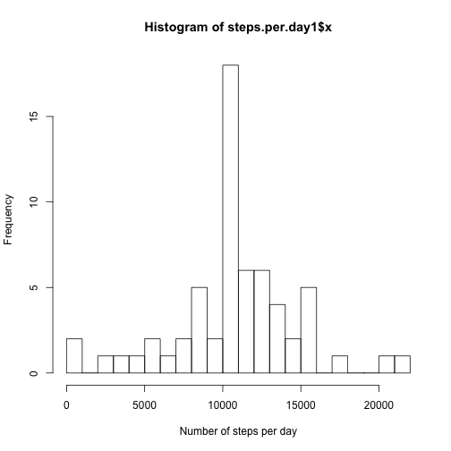
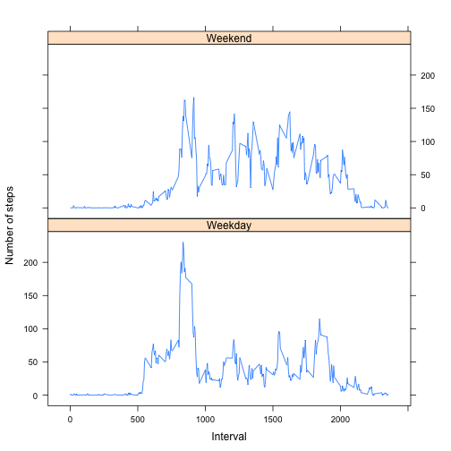

 
## Loading and preprocessing the data

```r
#Read csv file
activity <- read.csv("/Users/anvo/GitHub/RepData_PeerAssessment1/activity.csv")
#remove NA values
activity.clean <- na.omit(activity)
```
 
## What is mean total number of steps taken per day?   
 
1. Calculate the total number of steps taken per day:

```r
attach(activity.clean)
steps.per.day <- aggregate(activity.clean$steps,by=list(date),FUN=sum,na.rm=TRUE)
detach(activity.clean)
# See first 6 records of steps.per.day
head(steps.per.day)
```

```
##      Group.1     x
## 1 2012-10-02   126
## 2 2012-10-03 11352
## 3 2012-10-04 12116
## 4 2012-10-05 13294
## 5 2012-10-06 15420
## 6 2012-10-07 11015
```
  
2. Make a histogram of the total number of steps taken each day  

```r
hist(steps.per.day$x,breaks=20,xlab="Number of steps per day")
```

 
 
3. Calculate and report the mean and median of the total number of steps taken per day   
Mean:

```r
mean(steps.per.day$x)
```

```
## [1] 10766.19
```
 
Median:

```r
median(steps.per.day$x)
```

```
## [1] 10765
```
 
## What is the average daily activity pattern?
 
1. Make a time series plot (i.e. type = "l") of the 5-minute interval (x-axis) and the average number of steps taken, averaged across all days (y-axis)

```r
# Calculate average number of steps taken in 5-min intervals
attach(activity.clean)
steps.per.interval <- aggregate(activity.clean$steps,by=list(interval),FUN=mean,na.rm=TRUE)
detach(activity.clean)
# See first 6 records of steps.per.interval
head(steps.per.interval)
```

```
##   Group.1         x
## 1       0 1.7169811
## 2       5 0.3396226
## 3      10 0.1320755
## 4      15 0.1509434
## 5      20 0.0754717
## 6      25 2.0943396
```

```r
# Plot steps.per.interval
plot(steps.per.interval,type="l",xlab="5 minute intervals",ylab="Average number of steps taken")
```

 
 
2. Which 5-minute interval, on average across all the days in the dataset, contains the maximum number of steps?  

```r
steps.per.interval[which.max(steps.per.interval$x),1]
```

```
## [1] 835
```
 
## Imputing missing values  
1. Calculate and report the total number of missing values in the dataset (i.e. the total number of rows with NAs)   

```r
sum(is.na(activity$steps))
```

```
## [1] 2304
```
 
2. Devise a strategy for filling in all of the missing values in the dataset: use the mean for that 5-minute interval (rounded to integer).   

```r
# Name columns in steps.per.interval
colnames(steps.per.interval) <- c("interval", "avg steps")
# Fill first column of activity1 with average steps in 5 min interval
library(plyr)
activity1 <- join(activity,steps.per.interval,by="interval")
for (i in 1:length(activity1[,1])) {
  if (is.na(activity1[i,1])) {
    activity1[i,1] <- round(activity1[i,4],digits=0)
  }
}
```
 
3. Create a new dataset that is equal to the original dataset but with the missing data filled in.   

```r
activity1 <- activity1[,-4]
# See the first 6 rows of new dataset
head(activity1)
```

```
##   steps       date interval
## 1     2 2012-10-01        0
## 2     0 2012-10-01        5
## 3     0 2012-10-01       10
## 4     0 2012-10-01       15
## 5     0 2012-10-01       20
## 6     2 2012-10-01       25
```
 
4. Make a histogram of the total number of steps taken each day 

```r
attach(activity1)
steps.per.day1 <- aggregate(activity1$steps,by=list(date),FUN=sum,na.rm=TRUE)
detach(activity1)
hist(steps.per.day1$x,breaks=20,xlab="Number of steps per day")
```

 
 
Calculate and report the mean and median total number of steps taken per day. 

```r
# Mean
mean(steps.per.day1$x)
```

```
## [1] 10765.64
```

```r
# Median
median(steps.per.day1$x)
```

```
## [1] 10762
```
 
Do these values differ from the estimates from the first part of the assignment? What is the impact of imputing missing data on the estimates of the total daily number of steps?   
 
Answer: Mean and median of number of steps per day after filling in missing values are slightly different from the estimates from the first part of the assignment. New mean is 10765.64, compare with old mean 10766.19. New median is 10762, compare with old median 10765. There is not a lot of impact on the estimates of the total daily number of steps after imputting missing data.
 
## Are there differences in activity patterns between weekdays and weekends?   
 
1. Create a new factor variable in the dataset with two levels – “weekday” and “weekend” indicating whether a given date is a weekday or weekend day.

```r
# Create a vector showing day of the week from the dataset
wd <- weekdays(as.Date(activity1[,2]))
# Create a factor variable vector showing whether the day is weekday or weekend
isWeekday <- as.factor(ifelse(wd %in% c("Saturday","Sunday"), "Weekend", "Weekday"))
# Column-bind the weekday/weekend factor vector to dataset
activity1 <- cbind(activity1,isWeekday)
# See first 6 records of dataset
head(activity1)
```

```
##   steps       date interval isWeekday
## 1     2 2012-10-01        0   Weekday
## 2     0 2012-10-01        5   Weekday
## 3     0 2012-10-01       10   Weekday
## 4     0 2012-10-01       15   Weekday
## 5     0 2012-10-01       20   Weekday
## 6     2 2012-10-01       25   Weekday
```


2. Make a panel plot containing a time series plot (i.e. type = "l") of the 5-minute interval (x-axis) and the average number of steps taken, averaged across all weekday days or weekend days (y-axis). See the README file in the GitHub repository to see an example of what this plot should look like using simulated data.

```r
# Create dataset with average number of steps per interval, 
# factored by Weekday/Weekend   
attach(activity1)
```

```
## The following object is masked _by_ .GlobalEnv:
## 
##     isWeekday
```

```r
steps.per.interval.wd <- aggregate(activity1$steps,by=list(interval,isWeekday),FUN=mean,na.rm=TRUE)
detach(activity1)
colnames(steps.per.interval.wd) <- c("interval","isWeekday","avg.steps")
# Plot
library(lattice)
xyplot(avg.steps ~ interval | isWeekday, data=steps.per.interval.wd,
       layout=c(1,2), type="l", xlab="Interval", ylab="Number of steps")
```

 
